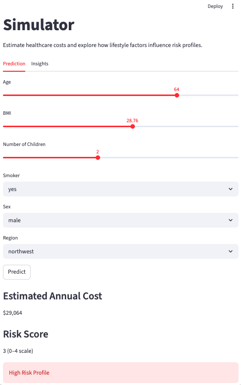

# Insurance Claim Analytics: Cost Drivers, Risk Segmentation and Predictive Modeling  
*Analyzing healthcare cost drivers and predicting high-cost claim risk using data analytics, causal inference and machine learning.*

An interactive application based on this project was also developed using Streamlit: [Insurance Risk Prediction Simulator](https://github.com/Vanessa22400/insurance_risk_prediction_simulator/tree/main)

**Dataset:** Health Insurance Dataset (1,338 individuals)  
**Techniques:** SQL analysis, exploratory data analysis (EDA), risk segmentation, K-Means clustering, causal inference (Propensity Score Matching), predictive modeling (Linear Regression & Random Forest), classification modeling, threshold tuning.  
**Key Insight:** Smoking is the strongest cost driver, increasing healthcare costs by approximately **$23,500 per individual per year** (~4x higher costs) and playing a central role in high-cost claim risk.

---

## Project Context

This project focuses on how data analytics can support decision-making in an insurance context, particularly in understanding cost drivers and identifying high-risk claims.

It is part of a broader analytical exploration.  
A complementary project extends this analysis toward [preventive strategies and health outcomes](https://github.com/Vanessa22400/Preventive_Health_Analytics), building on the risk insights identified here. 

---

## Interactive Application

An interactive version of this project was developed to make the analysis more accessible and easier to explore.

The application allows users to simulate different profiles and understand how factors such as smoking, BMI and age influence healthcare costs and risk levels.

You can access it here: [Insurance Risk Prediction Simulator](https://github.com/Vanessa22400/insurance_risk_prediction_simulator/tree/main)




---

## Business Context

In the insurance industry, understanding cost drivers and risk concentration is essential for pricing, portfolio management and long-term sustainability.

Key questions explored include:

- What factors drive higher healthcare costs?  
- How are costs distributed across the population?  
- Which individuals are more likely to generate high-cost claims?  
- How can models support better decision-making?  

---

## Dataset

Source:  
https://www.kaggle.com/datasets/mirichoi0218/insurance

- **1,338 individuals**
- **7 variables**
- no missing values
- fully anonymized

Main variables:

`age`, `sex`, `bmi`, `children`, `smoker`, `region`, `charges`

Healthcare costs range from ~$1,000 to over $63,000, highlighting a clear **high-cost segment**.

---

## Analytical Workflow

1. SQL-based exploration  
2. Exploratory Data Analysis (EDA)  
3. Risk segmentation  
4. Customer segmentation (clustering)  
5. Causal inference  
6. Predictive modeling (regression)
7. Claim risk modeling (classification)
8. Threshold tuning and decision analysis  

---

## Key Analyses

### SQL + Exploratory Analysis

Initial exploration shows strong differences across groups:

- smokers have ~4x higher costs than non-smokers  
- costs increase consistently with age  
- higher BMI is associated with higher costs  
- combined risk factors significantly amplify costs  

---

### Risk Segmentation

A simple risk score shows that:

- risk factors accumulate rather than act independently  
- higher risk scores lead to exponentially higher costs  
- a small high-risk group drives a large share of total expenses  

---

### Customer Segmentation (Clustering)

K-Means clustering identifies distinct population groups:

- young & low-cost segment  
- family segment  
- older population  
- high-risk lifestyle segment  

Each segment presents different cost patterns and risk levels.

---

### Causal Inference

Propensity Score Matching shows that:

- smoking increases costs by approximately **$23,500 per year**  
- even after controlling for other factors, the effect remains strong  

---

### Predictive Modeling

- Linear Regression (R² ≈ 0.78)  
- Random Forest (R² ≈ 0.86)  

Main drivers:

- smoking  
- BMI  
- age  

---

### Claim Risk Modeling (Classification)

A binary variable was created to identify individuals with higher likelihood of generating high-cost claims.

Models used:

- Logistic Regression  
- Random Forest Classifier  

Key results:

- Random Forest achieved higher precision (~0.96) and overall performance, improving reliability in identifying high-risk claims
- models can effectively distinguish high-risk individuals

---

### Threshold Tuning and Decision Analysis

Instead of relying only on predictions, different probability thresholds were tested.

Key finding:

- lowering the threshold does **not improve recall (~0.79 remains unchanged)**  
- but **reduces precision (0.96 → 0.92)**, increasing false positives  

The default threshold (0.5) provides the best balance between risk detection and false alerts.

---

## Healthcare Cost Drivers Dashboard


**Figure:** Summary dashboard combining cost distribution, smoking impact, BMI effects, risk score behavior and feature importance.

---

## Key Insights

- **Smoking is the strongest cost driver**, strongly associated with high-cost claims  
- Risk factors **accumulate and amplify costs**  
- A small group of individuals generates a disproportionate share of expenses  
- Predictive models can estimate costs and identify high-risk cases  
- Model decisions depend on how predictions are used, not only on accuracy  

---

## Business Applications

- improved cost forecasting based on key risk drivers  
- better understanding of risk concentration across the portfolio  
- identification of high-risk individuals (potential high-cost claims)  
- support for more structured and data-driven decision-making 

---

## Limitations

- relatively small dataset  
- limited number of variables  
- no longitudinal data  

---

## Next Steps

- test additional machine learning models  
- incorporate more complex datasets  
- develop interactive dashboards  
- explore real-world insurance applications  

---

## Repository Structure

```
.
├── data
│ └── insurance.csv
├── notebooks
│ └── Insurance_Risk_Analytics.ipynb
├── images
│ └── Healthcare_Cost_Dashboard.png
├── requirements.txt
└── README.md
```

---

## Conclusion

This project demonstrates how data analysis and predictive modeling can support the identification and management of high-cost claims.

By combining exploratory analysis, segmentation, causal inference and machine learning, it becomes possible to identify key cost drivers, quantify their impact and translate these insights into more structured, data-driven decisions.


